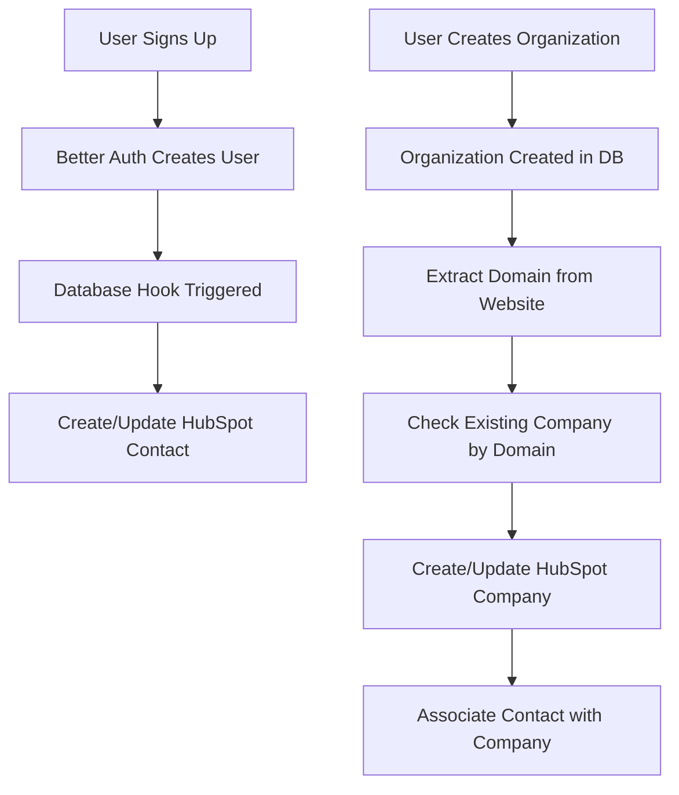

# HubSpot Integration for User Signup & Company Creation

This document explains how HubSpot is integrated into the Comp AI application for tracking user signups and company creation.

## Overview

The integration automatically:

1. Creates or updates HubSpot contacts when users sign up
2. Creates or updates HubSpot companies when organizations are created
3. Associates contacts with their companies

## Setup

1. **Environment Variable**
   Add your HubSpot private app access token to your `.env.local`:

   ```
   HUBSPOT_ACCESS_TOKEN=your_private_app_token_here
   ```

2. **Required HubSpot Scopes**
   Your private app needs these scopes:
   - `crm.objects.contacts.read`
   - `crm.objects.contacts.write`
   - `crm.objects.companies.read`
   - `crm.objects.companies.write`
   - `crm.objects.associations.read`

## Integration Points

### 1. User Signup (Contact Creation)

**Location**: `apps/app/src/utils/auth.ts`

When a new user signs up through Better Auth, a database hook automatically:

- Checks if a HubSpot contact already exists with that email
- Creates a new contact if none exists
- Updates the contact with the user's name if available

```typescript
databaseHooks: {
  user: {
    create: {
      after: async (user) => {
        // HubSpot contact creation logic
      };
    }
  }
}
```

### 2. Organization Creation (Company Creation)

**Locations**:

- `apps/app/src/app/(app)/setup/actions/create-organization-minimal.ts`
- `apps/app/src/app/(app)/setup/actions/create-organization.ts`

When an organization is created during setup:

- Extracts the domain from the company website URL
- Checks if a company already exists with that domain
- Creates or updates the company with:
  - Company name
  - Domain
  - Employee count (if available)
  - Compliance frameworks needed
  - Organization ID (custom property)
- Associates the user's contact with the company

## Custom HubSpot Properties

The integration uses these HubSpot properties:

### Company Properties

- `name` - Company name (standard)
- `domain` - Company domain (standard)
- `numberofemployees` - Employee count (standard)
- `compliance_frameworks` - Comma-separated list of framework names in lowercase with no spaces (e.g., "soc2,iso27001,gdpr") (custom)
- `org_id` - Comp AI organization ID (custom)

### Contact Properties

- `email` - Contact email (standard)
- `firstname` - First name (standard)
- `lastname` - Last name (standard)

## Error Handling

The integration is designed to fail gracefully:

- HubSpot errors don't block user signup or organization creation
- All errors are logged with `[HubSpot]` prefix for easy debugging
- If HubSpot is not configured (no API key), operations are skipped silently

## Field Update Logic

The integration follows a "don't overwrite existing data" principle:

- **Contact Updates**: Only updates fields that are empty in HubSpot
  - If a contact already has a name, it won't be overwritten
  - If a contact already has a phone number, it won't be overwritten
- **Company Updates**: Only updates fields that are empty or have default values
  - Company name is only updated if empty
  - Employee count is only updated if empty or 0, and only if we have a valid value (> 0)
  - Compliance frameworks are only updated if empty
  - Organization ID is only updated if empty
- **No Zero Values**: We never pass `companySize: 0` - if we don't have employee count data, we omit the field entirely

This ensures that:

1. Manual updates in HubSpot are preserved
2. More complete data from other sources isn't overwritten with partial data
3. Empty or zero values don't replace real data

## Testing

### Without HubSpot

To test without HubSpot:

1. Don't set `HUBSPOT_ACCESS_TOKEN` in your environment
2. The integration will skip HubSpot operations
3. Check console logs for `[HubSpot]` messages

### With HubSpot

To test with HubSpot:

1. Set up a HubSpot sandbox account
2. Create a private app with required scopes
3. Add the access token to your environment
4. Monitor HubSpot for created contacts and companies

## Monitoring

Look for these log messages:

- `[HubSpot] Creating contact for new user: email@example.com`
- `[HubSpot] Contact already exists with ID: 12345`
- `[HubSpot] Creating company for organization: Company Name`
- `[HubSpot] Company created/updated with ID: 67890`
- `[HubSpot] Associated contact with company`

## Data Flow



## Troubleshooting

1. **Contact not created**: Check if `HUBSPOT_ACCESS_TOKEN` is set
2. **Company not associated**: Ensure contact exists before company creation
3. **Domain extraction fails**: Verify website URL is valid
4. **API errors**: Check HubSpot API limits and token permissions
