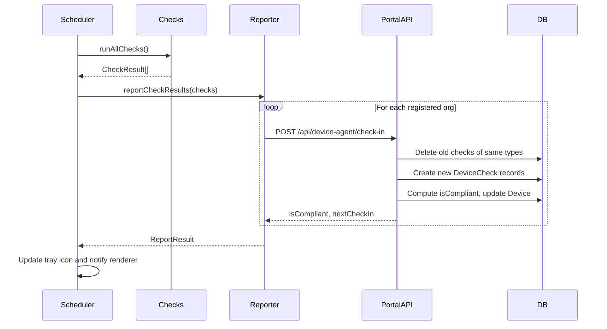
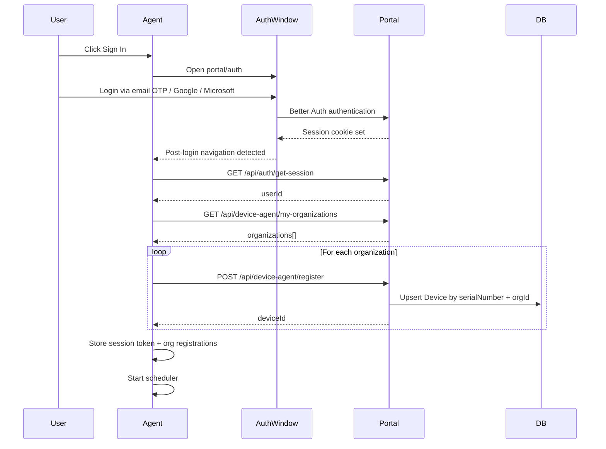
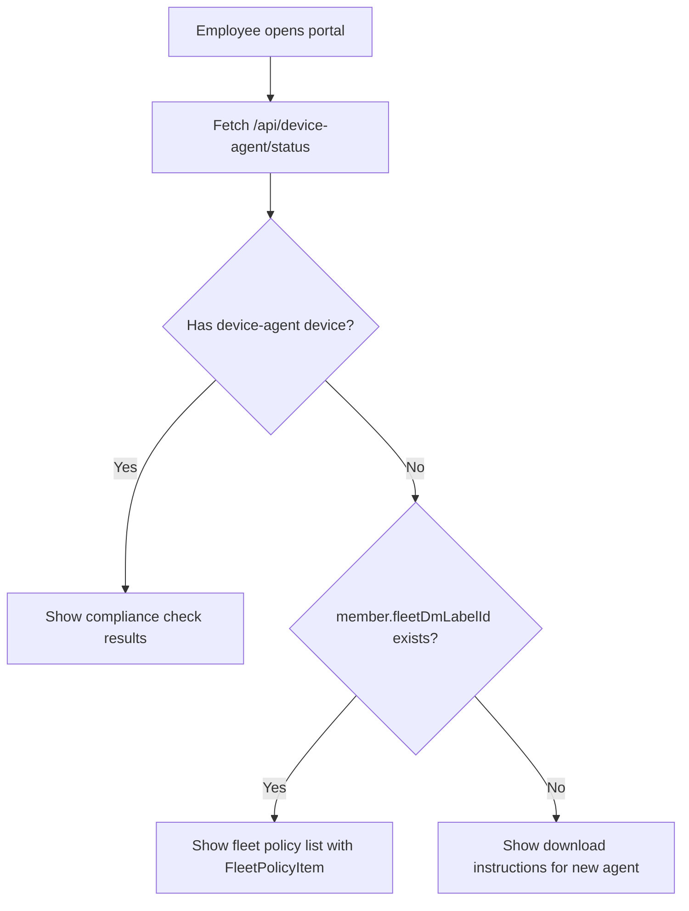
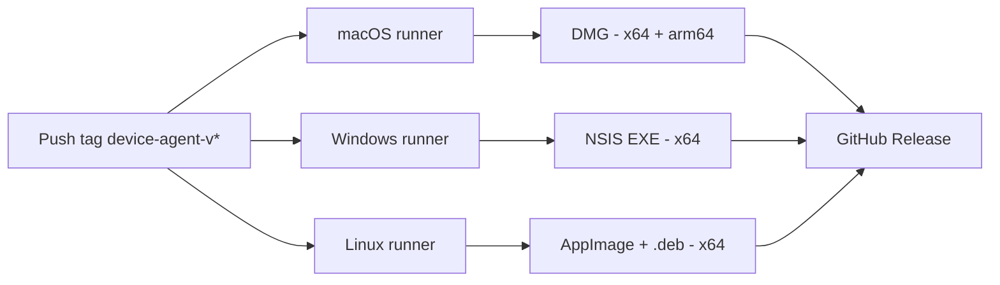

# Comp AI Device Agent -- Technical Specification

> Canonical reference for the device compliance system.
> Last updated: February 2026

---

## Table of Contents

1. [Overview and Motivation](#1-overview-and-motivation)
2. [System Architecture](#2-system-architecture)
3. [Electron App Architecture](#3-electron-app-architecture)
4. [Compliance Checks](#4-compliance-checks)
5. [Remediations](#5-remediations)
6. [Authentication Flow](#6-authentication-flow)
7. [Database Schema](#7-database-schema)
8. [Portal API Endpoints](#8-portal-api-endpoints)
9. [Admin App Integration](#9-admin-app-integration)
10. [NestJS API Integration](#10-nestjs-api-integration)
11. [Backward Compatibility with FleetDM](#11-backward-compatibility-with-fleetdm)
12. [CI/CD and Release Process](#12-cicd-and-release-process)
13. [Key File Reference](#13-key-file-reference)
14. [Known Limitations and Future Work](#14-known-limitations-and-future-work)

---

## 1. Overview and Motivation

The Comp AI Device Agent is a custom Electron-based system tray application that replaces the previous FleetDM-based device compliance system.

### Why the change

| Aspect            | FleetDM (old)                                  | Device Agent (new)                     |
| ----------------- | ---------------------------------------------- | -------------------------------------- |
| Infrastructure    | External hosted FleetDM server                 | Self-contained Electron app            |
| Device tracking   | FleetDM labels + marker files                  | Direct DB registration via portal API  |
| Compliance checks | FleetDM osquery policies                       | Local platform-specific checks         |
| Data storage      | FleetDM API (external)                         | PostgreSQL via Prisma (our DB)         |
| User experience   | Manual image uploads for proof                 | Automated checks with auto-remediation |
| Setup flow        | Download scripts, marker files, MDM enrollment | Install app, sign in, done             |

### What the agent checks

The agent runs four compliance checks every hour:

1. **Disk Encryption** -- FileVault (macOS), BitLocker (Windows), LUKS (Linux)
2. **Antivirus** -- XProtect (macOS), Windows Defender (Windows), ClamAV/AppArmor/SELinux (Linux)
3. **Password Policy** -- Minimum 8-character password enforced at OS level
4. **Screen Lock** -- Automatic screen lock within 5 minutes of inactivity

A device is **compliant** when all four checks pass.

---

## 2. System Architecture

```mermaid
flowchart TD
    subgraph electronApp [Device Agent - Electron App]
        MainProcess["Main Process"]
        Scheduler["Scheduler - 1hr interval"]
        Checks["Compliance Checks"]
        Reporter["Reporter"]
        TrayIcon["System Tray"]
        Renderer["Status Window - React"]
        AuthFlow["Auth - BrowserWindow"]
        Store["Encrypted Store"]
        Remediations["Remediations"]
    end

    subgraph portalAPI [Portal API - Next.js]
        RegisterAPI["POST /api/device-agent/register"]
        CheckInAPI["POST /api/device-agent/check-in"]
        StatusAPI["GET /api/device-agent/status"]
        OrgsAPI["GET /api/device-agent/my-organizations"]
        FleetPoliciesAPI["GET /api/fleet-policies - Legacy"]
        ConfirmFleetAPI["POST /api/confirm-fleet-policy - Legacy"]
    end

    subgraph adminApp [Admin App - Next.js]
        DevicesPage["Devices Page"]
        EmployeeDetail["Employee Detail"]
        MemberRow["Member Row"]
    end

    subgraph nestAPI [NestJS API]
        DevicesEndpoint["GET /v1/devices"]
        UnlinkEndpoint["PATCH /v1/people/:id/unlink-device"]
    end

    subgraph database [PostgreSQL]
        DeviceTable["Device"]
        DeviceCheckTable["DeviceCheck"]
        FleetPolicyResultTable["FleetPolicyResult - Legacy"]
        MemberTable["Member.fleetDmLabelId - Legacy"]
    end

    subgraph external [External]
        FleetDMAPI["FleetDM API - Legacy"]
        BetterAuth["Better Auth"]
    end

    MainProcess --> Scheduler
    Scheduler --> Checks
    Checks --> Reporter
    Reporter --> CheckInAPI
    MainProcess --> TrayIcon
    MainProcess --> Renderer
    MainProcess --> AuthFlow
    MainProcess --> Store
    MainProcess --> Remediations
    AuthFlow --> BetterAuth
    AuthFlow --> OrgsAPI
    AuthFlow --> RegisterAPI
    RegisterAPI --> DeviceTable
    CheckInAPI --> DeviceTable
    CheckInAPI --> DeviceCheckTable
    StatusAPI --> DeviceTable
    DevicesPage --> DeviceTable
    DevicesPage --> FleetDMAPI
    EmployeeDetail --> DeviceTable
    EmployeeDetail --> FleetDMAPI
    FleetPoliciesAPI --> FleetDMAPI
    DevicesEndpoint --> DeviceTable
    DevicesEndpoint --> FleetDMAPI
    UnlinkEndpoint --> DeviceTable
    UnlinkEndpoint --> FleetDMAPI
```



### Data flow summary

1. **Employee installs** the device agent and signs in via the portal
2. **Agent registers** the device for all of the user's organizations via `POST /api/device-agent/register`
3. **Every hour**, the scheduler runs all compliance checks locally and reports results via `POST /api/device-agent/check-in`
4. **Admin app** reads device data from the `Device` / `DeviceCheck` tables (and FleetDM for legacy devices)
5. **Portal** shows the employee their device compliance status and remediation options

---

## 3. Electron App Architecture

The agent lives at `packages/device-agent/` and is built with Electron + electron-vite + React.

### Directory structure

```
packages/device-agent/
  src/
    main/           # Electron main process
      index.ts      # App lifecycle, IPC handlers, tray, scheduler coordination
      auth.ts       # BrowserWindow login flow, multi-org registration
      auto-launch.ts# Start-at-login management (all platforms)
      scheduler.ts  # Periodic check runner (1-hour interval)
      reporter.ts   # Sends check results to portal API for all orgs
      store.ts      # Encrypted persistent storage (electron-store)
      tray.ts       # System tray icon, context menu, status window
      device-info.ts# Platform-specific device info collection
      logger.ts     # File-based logging
    checks/         # Compliance check modules
      types.ts      # ComplianceCheck interface
      index.ts      # Platform router + runAllChecks()
      macos/        # macOS-specific checks (4 files)
      windows/      # Windows-specific checks (4 files)
      linux/        # Linux-specific checks (4 files)
    remediations/   # Auto-fix and guided instructions
      types.ts      # ComplianceRemediation interface
      index.ts      # Platform router + runRemediation()
      instructions.ts # Per-platform guided step text
      macos/        # macOS-specific remediations (4 files)
      windows/      # Windows-specific remediations (4 files)
      linux/        # Linux-specific remediations (4 files)
    renderer/       # React UI (status window)
      App.tsx       # Main component with check cards + remediation buttons
      main.tsx      # React entry point
      index.html    # HTML shell
      styles.css    # Tailwind CSS
    preload/
      index.ts      # contextBridge IPC API
    shared/
      types.ts      # Shared TypeScript types
      constants.ts  # Portal URL, check interval, API routes, version
  assets/           # Icons (tray, app icon, logo)
  electron-builder.yml  # Build/packaging config
  electron.vite.config.ts # Vite config for main/preload/renderer
```

### Main process lifecycle

1. App starts, requests single-instance lock
2. Hides dock icon on macOS (tray-only app)
3. Creates system tray with icon and context menu
4. Syncs auto-launch (start at login) setting with the OS (see [Auto-launch](#auto-launch) below)
5. If already authenticated (stored session), starts the scheduler immediately
6. If not authenticated, opens the sign-in BrowserWindow automatically
7. Listens for IPC messages from the renderer (status window)
8. Handles auto-updates via `electron-updater` (when packaged)

### Auto-launch

The agent registers itself to start automatically at login using Electron's `app.setLoginItemSettings()` API. This is **enabled by default** so the agent is always running and able to send compliance updates.

| Platform | Mechanism                                                     | User Visibility                         |
| -------- | ------------------------------------------------------------- | --------------------------------------- |
| macOS    | Login Items via Launch Services                               | System Settings > General > Login Items |
| Windows  | Registry `HKCU\Software\Microsoft\Windows\CurrentVersion\Run` | Task Manager > Startup tab              |
| Linux    | `.desktop` file in `~/.config/autostart/`                     | Desktop environment startup settings    |

- The preference is persisted in the encrypted store (`openAtLogin`, default `true`)
- On every launch, `initAutoLaunch()` re-syncs the OS setting with the stored preference (handles app path changes after auto-updates)
- Users can toggle it via the "Start at Login" checkbox in the tray context menu
- On macOS, the app starts hidden (`openAsHidden: true`) to avoid flashing a window

### Check-in cycle



### IPC channels

Communication between the main process and the renderer uses named IPC channels:

| Channel                       | Direction        | Purpose                                |
| ----------------------------- | ---------------- | -------------------------------------- |
| `auth:get-status`             | Renderer -> Main | Get current auth state                 |
| `auth:login`                  | Renderer -> Main | Trigger sign-in flow                   |
| `auth:logout`                 | Renderer -> Main | Sign out                               |
| `auth:state-changed`          | Main -> Renderer | Auth state changed                     |
| `checks:get-results`          | Renderer -> Main | Get last check results                 |
| `checks:run-now`              | Renderer -> Main | Trigger immediate check run            |
| `checks:results-updated`      | Main -> Renderer | New check results available            |
| `device:get-info`             | Renderer -> Main | Get device info                        |
| `remediation:get-info`        | Renderer -> Main | Get remediation options for all checks |
| `remediation:remediate-check` | Renderer -> Main | Run remediation for a specific check   |

### Encrypted store

The agent uses `electron-store` with encryption to persist:

| Key                | Type                 | Purpose                                                     |
| ------------------ | -------------------- | ----------------------------------------------------------- |
| `auth`             | `StoredAuth \| null` | Session token, userId, org registrations (deviceId per org) |
| `portalUrl`        | `string`             | Portal base URL (auto-set based on dev/prod)                |
| `lastCheckResults` | `CheckResult[]`      | Results from the most recent check run                      |
| `checkIntervalMs`  | `number`             | Check interval in ms (default: 1 hour)                      |
| `openAtLogin`      | `boolean`            | Start agent at login (default: `true`)                      |

---

## 4. Compliance Checks

Each check implements the `ComplianceCheck` interface:

```typescript
interface ComplianceCheck {
  checkType: DeviceCheckType;
  displayName: string;
  run(): Promise<CheckResult>;
}
```

### Check matrix

| Check Type          | macOS                                        | Windows                              | Linux                                          |
| ------------------- | -------------------------------------------- | ------------------------------------ | ---------------------------------------------- |
| **disk_encryption** | `fdesetup status` (FileVault)                | `manage-bde -status` (BitLocker)     | `lsblk` + `cryptsetup` (LUKS)                  |
| **antivirus**       | XProtect plist existence + version check     | `Get-MpComputerStatus` (Defender)    | ClamAV daemon + AppArmor/SELinux status        |
| **password_policy** | `pwpolicy -getaccountpolicies` (min 8 chars) | `net accounts` (min password length) | `/etc/login.defs` PASS_MIN_LEN + pam_pwquality |
| **screen_lock**     | `defaults read` screensaver idle time        | `powercfg /query` monitor timeout    | `gsettings` idle-delay / `xdg-screensaver`     |

### Check result format

```typescript
interface CheckResult {
  checkType: 'disk_encryption' | 'antivirus' | 'password_policy' | 'screen_lock';
  passed: boolean;
  details: {
    method: string; // Detection method used (e.g., "fdesetup")
    raw: string; // Raw command output
    message: string; // Human-readable result (e.g., "FileVault is enabled")
  };
  checkedAt: string; // ISO 8601 timestamp
}
```

---

## 5. Remediations

Each remediation implements the `ComplianceRemediation` interface:

```typescript
interface ComplianceRemediation {
  checkType: DeviceCheckType;
  getInfo(): RemediationInfo;
  remediate(): Promise<RemediationResult>;
}
```

### Remediation types

| Type            | Description                                 | Example                                |
| --------------- | ------------------------------------------- | -------------------------------------- |
| `auto_fix`      | Agent can fix it automatically              | Setting password policy via `pwpolicy` |
| `admin_fix`     | Agent can fix it but needs admin privileges | Setting screen lock timeout            |
| `open_settings` | Opens the relevant OS settings pane         | Opening FileVault settings             |
| `guide_only`    | Shows step-by-step instructions only        | Enabling BitLocker (requires TPM)      |

The renderer UI shows a "Fix" / "Fix (Admin)" / "Open Settings" / "View Guide" button depending on the remediation type, plus expandable step-by-step instructions for each check.

After a successful auto-fix or admin-fix remediation, the agent automatically re-runs checks to verify the fix took effect.

---

## 6. Authentication Flow

The agent authenticates users via a BrowserWindow that opens the portal's login page. After login, it registers the device for **all** of the user's organizations.



### Session management

- The session token (Better Auth cookie) is stored encrypted on disk
- On each check-in, if the API returns 401, the agent triggers a re-authentication flow
- On sign-out, cookies are cleared from the Electron session and stored auth is wiped

### Multi-org support

A user who belongs to multiple organizations has the device registered for **each** org. Check results are reported to all orgs on every check-in cycle. Each org gets its own `Device` record with its own `deviceId`.

---

## 7. Database Schema

### New models (`packages/db/prisma/schema/device.prisma`)

#### Device

| Column           | Type             | Notes                             |
| ---------------- | ---------------- | --------------------------------- |
| `id`             | `String`         | Prefixed CUID (`dev_...`)         |
| `name`           | `String`         | Computer name                     |
| `hostname`       | `String`         | Network hostname                  |
| `platform`       | `DevicePlatform` | Enum: `macos`, `windows`, `linux` |
| `osVersion`      | `String`         | e.g., "15.3.1"                    |
| `serialNumber`   | `String?`        | Hardware serial                   |
| `hardwareModel`  | `String?`        | e.g., "MacBook Pro"               |
| `userId`         | `String`         | FK to User                        |
| `organizationId` | `String`         | FK to Organization                |
| `isCompliant`    | `Boolean`        | All 4 checks passing              |
| `lastCheckIn`    | `DateTime?`      | Last successful check-in          |
| `agentVersion`   | `String?`        | e.g., "1.0.0"                     |
| `installedAt`    | `DateTime`       | First registration time           |
| `updatedAt`      | `DateTime`       | Last update                       |

**Unique constraint**: `(serialNumber, organizationId)` -- prevents duplicate registrations.

**Indexes**: `userId`, `organizationId`, `isCompliant`

#### DeviceCheck

| Column      | Type              | Notes                                                                  |
| ----------- | ----------------- | ---------------------------------------------------------------------- |
| `id`        | `String`          | Prefixed CUID (`dck_...`)                                              |
| `deviceId`  | `String`          | FK to Device (CASCADE delete)                                          |
| `checkType` | `DeviceCheckType` | Enum: `disk_encryption`, `antivirus`, `password_policy`, `screen_lock` |
| `passed`    | `Boolean`         | Check result                                                           |
| `details`   | `Json?`           | `{ method, raw, message }`                                             |
| `checkedAt` | `DateTime`        | When the check ran                                                     |

**Indexes**: `deviceId`, `checkType`

### Legacy models (still in schema)

These remain in the database for backward compatibility with FleetDM:

- **`Member.fleetDmLabelId`** (`Int?`) -- FleetDM label ID assigned to a member's device
- **`Organization.fleetDmLabelId`** (`Int?`) -- FleetDM label ID for the organization
- **`Organization.isFleetSetupCompleted`** (`Boolean`) -- Whether fleet setup was completed
- **`FleetPolicyResult`** -- Stores user-submitted compliance proof (images) for fleet policies. Fields: `userId`, `organizationId`, `fleetPolicyId`, `fleetPolicyName`, `fleetPolicyResponse`, `attachments[]`

---

## 8. Portal API Endpoints

All endpoints are in `apps/portal/src/app/api/device-agent/` and require Better Auth session authentication.

### POST /api/device-agent/register

Registers (or updates) a device for an organization.

**Request body** (Zod validated):

```typescript
{
  name: string;
  hostname: string;
  platform: 'macos' | 'windows';
  osVersion: string;
  serialNumber?: string;
  hardwareModel?: string;
  agentVersion?: string;
  organizationId: string;
}
```

**Behavior**: Upserts by `(serialNumber, organizationId)` unique constraint. Verifies the user is an active member of the organization.

**Response**: `{ deviceId: string }`

### POST /api/device-agent/check-in

Submits compliance check results for a device.

**Request body** (Zod validated):

```typescript
{
  deviceId: string;
  checks: Array<{
    checkType: 'disk_encryption' | 'antivirus' | 'password_policy' | 'screen_lock';
    passed: boolean;
    details?: { method: string; raw: string; message: string };
    checkedAt: string; // ISO 8601
  }>;
}
```

**Behavior** (within a transaction):

1. Deletes previous `DeviceCheck` records of the same types for this device
2. Creates new `DeviceCheck` records
3. Computes `isCompliant` (all 4 check types must exist and pass)
4. Updates `Device.lastCheckIn` and `Device.isCompliant`

**Response**: `{ isCompliant: boolean; nextCheckIn: string }`

### GET /api/device-agent/status

Returns device(s) and their checks for the authenticated user.

**Query params**:

- `deviceId` (optional) -- return a specific device
- `organizationId` (optional) -- filter by organization

**Response**: `{ devices: Device[] }` or `{ device: Device }`

### GET /api/device-agent/my-organizations

Returns all organizations the user belongs to.

**Response**:

```typescript
{
  organizations: Array<{
    organizationId: string;
    organizationName: string;
    organizationSlug: string;
    role: string;
  }>;
}
```

### Legacy Fleet endpoints (restored for backward compat)

| Endpoint                                     | Purpose                                                                                                                      |
| -------------------------------------------- | ---------------------------------------------------------------------------------------------------------------------------- |
| `GET /api/fleet-policies?organizationId=...` | Fetches FleetDM policies for the member's device label, merges with `FleetPolicyResult` DB records, signs S3 attachment URLs |
| `GET /api/fleet-policy?organizationId=...`   | Returns `FleetPolicyResult` records with signed S3 URLs                                                                      |
| `POST /api/confirm-fleet-policy`             | Accepts FormData with images, uploads to S3, creates/updates `FleetPolicyResult`                                             |

These endpoints are **read-only backward compatibility** -- no new fleet enrollments are created.

---

## 9. Admin App Integration

The admin app (`apps/app`) displays device data on the People page and Employee detail page.

### Devices list page

The `getAllDevices()` server action in `apps/app/src/app/(app)/[orgId]/people/devices/data/index.ts` fetches from both sources:

```
getAllDevices()
  |-- getEmployeeDevicesFromDB()  --> Device table (Prisma)
  |-- getFleetDevices()           --> FleetDM API (if configured)
  |-- deduplicateDevices()        --> Merge, agent devices take priority
```

**Deduplication logic**: Builds sets of serial numbers and hostnames from device-agent results. Fleet devices matching any known serial or hostname are excluded.

Each device carries a `source: 'device_agent' | 'fleet'` field. Fleet devices display a "Fleet (Legacy)" badge in the UI.

### Employee detail page

The employee detail page (`apps/app/src/app/(app)/[orgId]/people/[employeeId]/page.tsx`) fetches from both systems and the `EmployeeTasks` component renders with fallback logic:

1. If the member has a device-agent `Device` record -- show the new compliance checks table
2. Else if the member has FleetDM data (via `fleetDmLabelId`) -- show fleet policies with `PolicyItem`
3. Else -- show "No device found"

### Member row actions

`MemberRow` shows the "Remove Device" action when **either** `member.fleetDmLabelId` exists **or** the member has a device-agent `Device` record (passed as `hasDeviceAgentDevice` prop).

---

## 10. NestJS API Integration

The NestJS API (`apps/api`) exposes device endpoints for external consumers (API key or session auth).

### GET /v1/devices and GET /v1/devices/member/:memberId

`DevicesService` in `apps/api/src/devices/devices.service.ts` is a hybrid service:

1. Fetches from FleetDM API (if `fleetDmLabelId` exists) -- gracefully returns `[]` on failure
2. Fetches from `Device` table via Prisma
3. Merges with deduplication (agent devices take priority)
4. Each result includes `source: 'fleet' | 'device_agent'` in the DTO

### PATCH /v1/people/:id/unlink-device

`PeopleService.unlinkDevice()` in `apps/api/src/people/people.service.ts` handles both systems:

1. If `member.fleetDmLabelId` exists -- calls `FleetService.removeHostsByLabel()` (non-blocking on failure)
2. Deletes all `Device` records for the member's `userId` + `organizationId` from the DB
3. Sets `member.fleetDmLabelId` to `null`

---

## 11. Backward Compatibility with FleetDM

The system maintains read-only backward compatibility so employees and admins who previously used FleetDM can still see their data during the migration period.

### Decision logic (Employee Portal)



### What is preserved for FleetDM users

| Feature                                | Status                                                           |
| -------------------------------------- | ---------------------------------------------------------------- |
| View fleet policies on portal          | Preserved (restored `FleetPolicyItem`, `PolicyImageUploadModal`) |
| Upload compliance proof images         | Preserved (restored `POST /api/confirm-fleet-policy`)            |
| Refresh fleet policy data              | Preserved (restored `GET /api/fleet-policies`, SWR in portal)    |
| View fleet devices in admin            | Preserved (`getFleetDevices()`, `DevicesService` hybrid)         |
| "Remove Device" for fleet users        | Preserved (`fleetDmLabelId` check + FleetDM API removal)         |
| View fleet policies on employee detail | Preserved (fallback rendering in `EmployeeTasks`)                |

### What is NOT preserved

| Feature                                 | Reason                                |
| --------------------------------------- | ------------------------------------- |
| Fleet agent download scripts            | New users should use the device agent |
| Fleet label creation (`fleet-label.ts`) | No new fleet enrollments              |
| Fleet setup wizard                      | Replaced by device agent install flow |

### Graceful degradation

- If `FLEET_URL` / `FLEET_TOKEN` env vars are not set, all fleet functions return empty arrays
- If the org/member has no `fleetDmLabelId`, fleet API calls are skipped entirely
- If the FleetDM API is down, errors are logged and the system continues with device-agent data only
- Every fleet API call is wrapped in try/catch with non-blocking error handling

---

## 12. CI/CD and Release Process

### Triggering a release

Push a tag matching `device-agent-v*`:

```bash
git tag device-agent-v1.0.0
git push origin device-agent-v1.0.0
```

### Build pipeline (`.github/workflows/device-agent-release.yml`)



| Platform | Runner           | Output                       | Signing                                |
| -------- | ---------------- | ---------------------------- | -------------------------------------- |
| macOS    | `macos-latest`   | `.dmg` (x64 + arm64)         | Code signing + notarization (Apple ID) |
| Windows  | `windows-latest` | `.exe` (NSIS installer, x64) | Code signing (CSC)                     |
| Linux    | `ubuntu-latest`  | `.AppImage` + `.deb` (x64)   | None                                   |

### Auto-updates

The packaged app includes `electron-updater` which checks for new GitHub releases on startup. The `publish` config in `electron-builder.yml` points to `trycompai/comp` on GitHub.

### Local development

```bash
cd packages/device-agent
bun install
bun run dev       # Start in dev mode with hot reload
bun run build     # Build for production
bun run package:mac   # Package macOS DMG
bun run package:win   # Package Windows installer
bun run package:linux # Package Linux AppImage + .deb
```

---

## 13. Key File Reference

### Device Agent (Electron app)

| Concept                      | File                                                     |
| ---------------------------- | -------------------------------------------------------- |
| App entry point              | `packages/device-agent/src/main/index.ts`                |
| Auth / login flow            | `packages/device-agent/src/main/auth.ts`                 |
| Auto-launch (start at login) | `packages/device-agent/src/main/auto-launch.ts`          |
| Check scheduler              | `packages/device-agent/src/main/scheduler.ts`            |
| Check-in reporter            | `packages/device-agent/src/main/reporter.ts`             |
| Encrypted store              | `packages/device-agent/src/main/store.ts`                |
| System tray                  | `packages/device-agent/src/main/tray.ts`                 |
| Device info collector        | `packages/device-agent/src/main/device-info.ts`          |
| Check runner                 | `packages/device-agent/src/checks/index.ts`              |
| Check interface              | `packages/device-agent/src/checks/types.ts`              |
| Remediation runner           | `packages/device-agent/src/remediations/index.ts`        |
| Remediation instructions     | `packages/device-agent/src/remediations/instructions.ts` |
| Renderer UI                  | `packages/device-agent/src/renderer/App.tsx`             |
| Preload bridge               | `packages/device-agent/src/preload/index.ts`             |
| Shared types                 | `packages/device-agent/src/shared/types.ts`              |
| Shared constants             | `packages/device-agent/src/shared/constants.ts`          |
| Build config                 | `packages/device-agent/electron-builder.yml`             |
| Vite config                  | `packages/device-agent/electron.vite.config.ts`          |

### Portal API

| Concept                       | File                                                             |
| ----------------------------- | ---------------------------------------------------------------- |
| Device registration           | `apps/portal/src/app/api/device-agent/register/route.ts`         |
| Check-in endpoint             | `apps/portal/src/app/api/device-agent/check-in/route.ts`         |
| Device status                 | `apps/portal/src/app/api/device-agent/status/route.ts`           |
| User organizations            | `apps/portal/src/app/api/device-agent/my-organizations/route.ts` |
| Fleet policies (legacy)       | `apps/portal/src/app/api/fleet-policies/route.ts`                |
| Fleet policy results (legacy) | `apps/portal/src/app/api/fleet-policy/route.ts`                  |
| Confirm fleet policy (legacy) | `apps/portal/src/app/api/confirm-fleet-policy/route.ts`          |
| Fleet axios client (legacy)   | `apps/portal/src/utils/fleet.ts`                                 |

### Portal UI (Employee-facing)

| Concept                      | File                                                                                     |
| ---------------------------- | ---------------------------------------------------------------------------------------- |
| Portal page (data fetching)  | `apps/portal/src/app/(app)/(home)/[orgId]/page.tsx`                                      |
| Dashboard (server component) | `apps/portal/src/app/(app)/(home)/[orgId]/components/OrganizationDashboard.tsx`          |
| Task list (client component) | `apps/portal/src/app/(app)/(home)/[orgId]/components/EmployeeTasksList.tsx`              |
| Device accordion (hybrid)    | `apps/portal/src/app/(app)/(home)/[orgId]/components/tasks/DeviceAgentAccordionItem.tsx` |
| Fleet policy item (legacy)   | `apps/portal/src/app/(app)/(home)/[orgId]/components/tasks/FleetPolicyItem.tsx`          |
| Policy image upload (legacy) | `apps/portal/src/app/(app)/(home)/[orgId]/components/tasks/PolicyImageUploadModal.tsx`   |
| Fleet/Host types             | `apps/portal/src/app/(app)/(home)/[orgId]/types/index.ts`                                |

### Admin App

| Concept                    | File                                                                                 |
| -------------------------- | ------------------------------------------------------------------------------------ |
| Devices data layer         | `apps/app/src/app/(app)/[orgId]/people/devices/data/index.ts`                        |
| Device types               | `apps/app/src/app/(app)/[orgId]/people/devices/types/index.ts`                       |
| Devices list UI            | `apps/app/src/app/(app)/[orgId]/people/devices/components/EmployeeDevicesList.tsx`   |
| Device detail UI           | `apps/app/src/app/(app)/[orgId]/people/devices/components/DeviceDetails.tsx`         |
| Compliance chart           | `apps/app/src/app/(app)/[orgId]/people/devices/components/DeviceComplianceChart.tsx` |
| People page (devices tab)  | `apps/app/src/app/(app)/[orgId]/people/page.tsx`                                     |
| Employee detail page       | `apps/app/src/app/(app)/[orgId]/people/[employeeId]/page.tsx`                        |
| Employee tasks (hybrid)    | `apps/app/src/app/(app)/[orgId]/people/[employeeId]/components/EmployeeTasks.tsx`    |
| Member row (remove device) | `apps/app/src/app/(app)/[orgId]/people/all/components/MemberRow.tsx`                 |

### NestJS API

| Concept                  | File                                               |
| ------------------------ | -------------------------------------------------- |
| Devices service (hybrid) | `apps/api/src/devices/devices.service.ts`          |
| Devices controller       | `apps/api/src/devices/devices.controller.ts`       |
| Devices module           | `apps/api/src/devices/devices.module.ts`           |
| Device response DTO      | `apps/api/src/devices/dto/device-responses.dto.ts` |
| People service (unlink)  | `apps/api/src/people/people.service.ts`            |
| Fleet service (legacy)   | `apps/api/src/lib/fleet.service.ts`                |

### Database

| Concept                     | File                                                                                 |
| --------------------------- | ------------------------------------------------------------------------------------ |
| Device + DeviceCheck schema | `packages/db/prisma/schema/device.prisma`                                            |
| Migration                   | `packages/db/prisma/migrations/20260208120000_add_device_agent_models/migration.sql` |
| FleetPolicyResult schema    | `packages/db/prisma/schema/fleet-policy-result.prisma`                               |
| Organization (fleet fields) | `packages/db/prisma/schema/organization.prisma`                                      |
| Member (fleet fields)       | `packages/db/prisma/schema/auth.prisma`                                              |

### CI/CD

| Concept          | File                                         |
| ---------------- | -------------------------------------------- |
| Release workflow | `.github/workflows/device-agent-release.yml` |

---

## 14. Known Limitations and Future Work

### Current limitations

- **No new fleet enrollments**: Fleet download scripts (`fleet-label.ts`, `scripts/*`) were removed. Employees must use the new device agent going forward.
- **Portal download flow references deleted files**: `archive.ts` and `token/route.ts` import from deleted `scripts/` and `fleet-label.ts`. This is a pre-existing issue from the branch and does not affect the new device agent download flow.
- **Pre-existing type error**: `Employee.tsx` uses a `form` prop on the design system `Button` component, which is not in the component's type definitions. This is unrelated to the device agent.

### Future work

- **Full FleetDM deprecation**: Once all employees have migrated to the new device agent, remove all FleetDM-related code, DB fields (`fleetDmLabelId`), and API routes.
- **Linux support**: Linux compliance checks and remediations are implemented but the platform enum in the DB registration schema currently only accepts `macos` and `windows`. Extend to include `linux`.
- **Additional compliance checks**: The `DeviceCheckType` enum and check framework are extensible. New checks (e.g., OS update status, VPN connection) can be added by creating new check and remediation modules.
- **Push-based updates**: Currently the agent polls every hour. Consider using WebSockets or server-sent events for real-time policy changes.
- **Agent version tracking**: The `agentVersion` field is stored but not currently used for enforcement. Consider requiring minimum agent versions.
